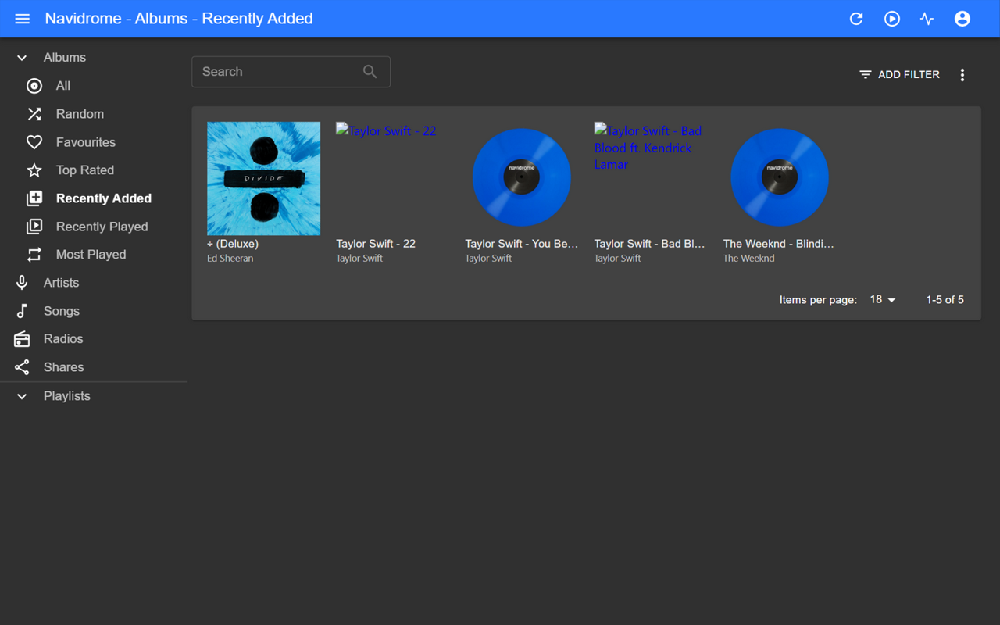

[](README.md)
[](README_zh.md)
[]()
[]()
[]()

# 🎵 musicfeed

**面向 YouTube Music 生态的智能批量下载器。**

大多数工具对所有 YouTube 链接一视同仁，musicfeed 不是。

## 🖼️ 实际效果

一条专辑链接 + 四首来自不同专辑的单曲，下载后放进
[Navidrome](https://www.navidrome.org/)——每首曲目都有正确的封面、
`album` / `album_artist` 标签和干净的 `歌手 - 歌名` 文件名：



*从左到右：一张完整 YTM 专辑（统一封面）+ 四首带逐曲 MV 封面的单曲——
MV 单曲的专辑名一律取歌名，每首都以正确封面和标签归入独立专辑条目。*

## 🆚 它有什么不同

### 1. 封面总是符合预期

YouTube Music 会把专辑封面填充成 16:9 缩略图，工具如何处理直接决定音乐库观感。

musicfeed 先读取曲目元数据，再决定封面策略：

| 曲目类型 | 封面处理 |
| --- | --- |
| YTM 音频曲目（有元数据） | 1:1 居中裁剪——还原原始方形专辑封面 |
| MV / 视频曲目（无元数据） | 仅压缩，保留原始比例 |
| YTM 专辑（统一模式） | 直接抓取播放列表级缩略图 |

### 2. 五种链接，五种策略

先识别链接类型，再开始交互：

| 链接类型 | 识别方式 | 处理策略 |
| --- | --- | --- |
| YTM 专辑 | `OLAK5uy_` 分享链接 **或** `MPREb_` browse 链接 | 统一专辑封面 + 正确的 `album_artist` 标签 |
| YTM 电台 / 合辑 | URL 含 `RDCLAK5uy_` | 逐曲独立封面 |
| YouTube 播放列表 | URL 含 `PL...` | MV 模式：逐曲手动输入或自动策略 |
| 单曲 | `watch?v=` / `youtu.be/` | 智能元数据检查 + 封面决策 |

> `MPREb_…` 是在 music.youtube.com 地址栏直接复制的专辑链接，
> `OLAK5uy_…` 是分享按钮生成的——两者指向同一专辑实体，处理方式完全一致。

### 3. 歌名出来就是干净的

电台/视频标题充满污染词（`【MV】【動態歌詞】(Official Audio)`…）。musicfeed 的提取引擎从原标题和上传频道重建 `歌手 - 歌名`：

- 书名号（`《》`）/ 括号污染词整段剔除
- 上传频道 ↔ 标题互相匹配，替代盲目的 `" - "` 拆分
- 无元数据曲目按提取结果重命名并写标签

### 4. 自建音乐库的正确 ID3 标签

每首曲目都正确写入 `album_artist`。这对 Navidrome 和 Jellyfin 很关键——没有它，多歌手专辑会在库里裂成多条。

### 5. 设置向导 + 永远可用的 TUI

`mf_setup.sh` 检测全部依赖，支持**一键安装**（系统包走 sudo，yt-dlp/mutagen 隔离在项目 venv——不碰系统 pip）。交互界面三层降级：`whiptail` → 方向键菜单 → 数字输入，任何 SSH 会话都能用。

## 🆕 v3.5.2 更新内容

- **支持 YTM 专辑 browse 直链（`MPREb_…`）**——从 music.youtube.com 地址栏
  复制的专辑链接不再报 "unknown link type"；与分享链接（`OLAK5uy_…`）
  处理方式完全一致

<details>
<summary>v3.5.0 更新</summary>

- **全新歌名提取引擎**（电台 & MV 播放列表）：书名号/括号规则替代简单 `" - "` 拆分 + 上传频道交叉匹配，118 首真实电台曲目验证
- **无元数据电台曲目重命名**：提取出的 `歌手 - 歌名` 同时写入标签和文件名（重名安全）
- **MV 模式元数据安全网**：info.json 有完整元数据时优先于手动预填值
- **选曲界面重构**：whiptail 原生 checklist + 「全选」项，或直接输入 `1,2,3-5,9` 区间；`0`/`b` 返回上一步
- **逐步骤状态机**：每个交互步骤都可回退
- **子文件夹语义**：创建 / 改名 / 不建，CLI 与 Web UI 一致
- **隔离 venv**：yt-dlp + mutagen 装进项目 `.venv`，删目录即彻底卸载

</details>

<details>
<summary>v3.2.0 更新</summary>

- 多歌手标签支持（`feat.` / `ft.` / `&` 拆分、合辑处理）
- 标准 `ALBUMARTIST` 字段
- 移除下载限速（不再触发反爬 403）

</details>

## 📋 环境要求

* **bash 4.0+**
* `ffmpeg`
* `python3`（含 `venv`）
* `node` ≥ 20（可选，并发下载用）

> **⚠️ macOS 用户注意：** macOS 自带 Bash 3.2，请用 Homebrew 安装（`brew install bash`）。yt-dlp 与 mutagen 由 `mf_setup.sh` 自动装进项目 venv。

## 📦 快速开始

```bash
git clone https://github.com/Unclezhanger/musicfeed.git
cd musicfeed

# 一次性设置（依赖检测 + 一键安装、音乐库路径、音频格式）
bash mf_setup.sh

# 开始下载
bash musicfeed.sh
```

### 可选：切换 yt-dlp nightly 版

YouTube 的反爬机制更新频繁，yt-dlp 的 nightly 版跟进更快，往往比稳定版
早数天修复失效问题。在项目目录执行（首次切换与后续更新都是同一条命令）：

```bash
.venv/bin/pip install --no-cache-dir --upgrade \
  "yt-dlp @ https://github.com/yt-dlp/yt-dlp-nightly-builds/releases/latest/download/yt-dlp.tar.gz"
```

或者重跑 `bash mf_setup.sh`——它会检测 venv 中已有的 nightly 并自动
升级到最新版。

## 🖥️ 更想要 Web 界面？

本仓库是 **CLI 版**。配套项目 [**mfui**](https://github.com/Unclezhanger/mfui) 提供：

- Web 界面（粘贴链接 → 选曲 → 配置 → 下载，实时日志）
- 多链接队列下载 + 聚合进度
- PWA（手机安装，分享链接直接进下载队列）
- **Docker** 分发（单容器，NAS / 家庭服务器用户推荐）

两者共用同一下载内核——`mf_config.sh` 通用。

## 📁 文件结构

| 文件 | 用途 |
|------|---------|
| `musicfeed.sh` | 主脚本（自包含） |
| `mf_setup.sh` | 设置向导 |
| `mf_config.sh` | 生成的配置（勿手动编辑） |

## ⚠️ 免责声明

仅供个人与学习使用，请遵守所在地区版权法律。作者不对任何滥用行为负责。

## 📄 许可证

MIT License © 2026 Unclezhanger
