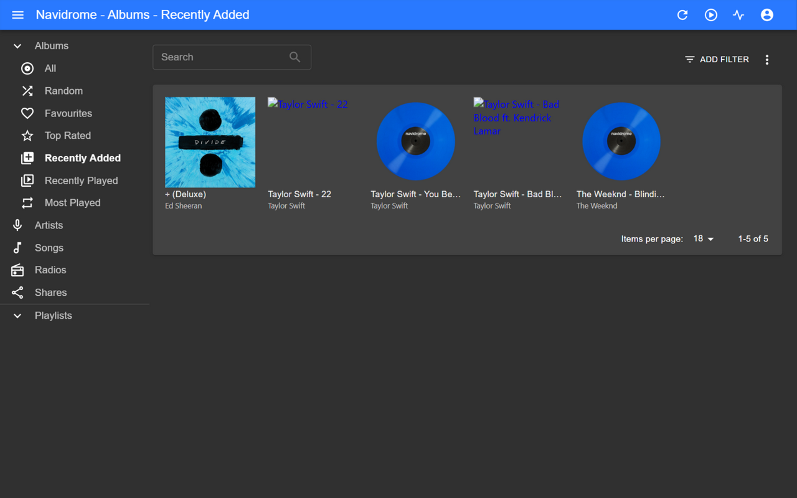

[](README.md)
[](README_zh.md)
[]()
[]()
[]()
[]()

# 🎵 musicfeed（音流）

**面向 YouTube Music 生态的智能批量下载器。**

大多数工具对所有 YouTube 链接一视同仁，musicfeed 不是。

**v4.0 对下载内核做了彻底重构：彻底摆脱 Python——打标签、封面、JSON
解析、歌名提取全部由 `ffmpeg` + `jq` + 纯 Bash 完成。**

## 🖼️ 实际效果

一条专辑链接 + 四首来自不同专辑的单曲，下载后放进
[Navidrome](https://www.navidrome.org/)——每首曲目都有正确的封面、
`album` / `album_artist` 标签和干净的 `歌手 - 歌名` 文件名：



*从左到右：一张完整 YTM 专辑（统一封面）+ 四首带逐曲 MV 封面的单曲——
MV 单曲的专辑名一律取歌名，每首都以正确封面和标签归入独立专辑条目。*

## 🆚 它有什么不同

### 1. 封面总是符合预期

YouTube Music 会把专辑封面填充成 16:9 缩略图，工具如何处理直接决定音乐库观感。

musicfeed 先读取曲目元数据，再决定封面策略：

| 曲目类型 | 封面处理 |
| --- | --- |
| YTM 音频曲目（有元数据） | 1:1 居中裁剪——还原原始方形专辑封面 |
| MV / 视频曲目（无元数据） | 仅压缩，保留原始比例 |
| YTM 专辑（统一模式） | 直接抓取播放列表级缩略图 |

### 2. 五种链接，五种策略

先识别链接类型，再开始交互：

| 链接类型 | 识别方式 | 处理策略 |
| --- | --- | --- |
| YTM 专辑 | `OLAK5uy_` 分享链接 **或** `MPREb_` browse 链接 | 统一专辑封面 + 正确的 `album_artist` 标签 |
| YTM 电台 / 合辑 | URL 含 `RDCLAK5uy_` | 逐曲独立封面 |
| YouTube 播放列表 | URL 含 `PL...` | MV 模式：逐曲手动输入或自动策略 |
| 单曲 | `watch?v=` / `youtu.be/` | 智能元数据检查 + 封面决策 |

> `MPREb_…` 是在 music.youtube.com 地址栏直接复制的专辑链接，
> `OLAK5uy_…` 是分享按钮生成的——两者指向同一专辑实体，处理方式完全一致。

### 3. 歌名出来就是干净的

电台/视频标题充满污染词（`【MV】【動態歌詞】(Official Audio)`…）。musicfeed 的提取引擎从原标题和上传频道重建 `歌手 - 歌名`：

- 书名号（`《》`）/ 括号污染词整段剔除
- 上传频道 ↔ 标题互相匹配，替代盲目的 `" - "` 拆分
- 无元数据曲目按提取结果重命名并写标签

v4.0 把整台引擎从 Python 移植到纯 Bash + `grep`/`sed`，与旧实现做了覆盖
全分支的逐字节比对验证。

### 4. 自建音乐库的正确标签

每首曲目都正确写入 `album_artist`。这对 Navidrome 和 Jellyfin 很关键——没有它，多歌手专辑会在库里裂成多条。

打标签现在完全由 `ffmpeg` 完成：已有标签是合并而非清空；音频流
`-c:a copy` 比特级无损；封面以真正的 `attached_pic` 流（M4A）或标准
`METADATA_BLOCK_PICTURE` 注释（Opus）嵌入——Navidrome、Jellyfin、
Mutagen 均可正常读取。

### 5. 设置向导顺便替你管理 yt-dlp

`mf_setup.sh` 检测全部依赖，并把结果放进摘要弹窗（✅ 全绿，或 ❌ 精确列出
缺什么），支持**一键安装**——系统包走 sudo，yt-dlp 直接使用官方**独立
二进制**（不再有 pip、不再有 venv）。

YouTube 反爬更新经常导致旧版 yt-dlp 整体失效，所以向导每次运行都会询问：

- **保持当前版本**
- **更新到最新稳定版**
- **切换到 nightly**（跟进反爬更快）

yt-dlp 被封了？重跑一次向导即可自救——不用手动删二进制，更不碰 pip。

交互界面三层降级：`whiptail` → 方向键菜单 → 数字输入，任何 SSH 会话都能
用；每个配置步骤都支持 **Esc 返回上一步**。

### 6. 并发安全

每个音乐库目录用 `flock` 串行化，worker 临时文件按 PID 隔离——往同一目录
同时跑多个下载不再出现临时文件、info.json、封面互抢。（超时可经
`MF_FLOCK_TIMEOUT` 调整。）

## 🆕 v4.0 更新内容

- **零 Python 内核**——打标签/封面走 `ffmpeg`（合并已有标签、音频流比特级
  无损、为 Opus 手工构造 FLAC Picture 块），JSON 走 `jq`，歌名提取纯 Bash
- **yt-dlp 独立二进制** + 向导内 stable/nightly 通道管理
- **并发加固**：目录级 `flock` + 临时文件 PID 隔离
- **修复**：多链接运行时曲目数双重累加（单曲继承上一链接的选曲计数）；
  播放列表解析丢空字段；空专辑出现幽灵曲目；M4A 封面被静默重编码（现为
  逐字节一致嵌入）
- **向导体验**：依赖摘要弹窗、全步骤可回退、macOS 依赖提示

<details>
<summary>v3.5.x 更新</summary>

- 电台 & MV 播放列表歌名提取引擎：书名号/括号规则 + 上传频道交叉匹配，118 首真实电台曲目验证
- 无元数据电台曲目重命名（重名安全），MV 模式元数据安全网
- 选曲界面：whiptail 勾选 + 「全选」+ 区间输入（`1,2,3-5,9`）；逐步骤状态机
- 支持 YTM 专辑 browse 直链（`MPREb_…`）
- 多歌手标签支持、标准 `ALBUMARTIST` 字段、移除下载限速

</details>

## 📋 环境要求

* **bash 4.0+**
* `ffmpeg`（打标签、封面、音频转换）
* `jq`（元数据解析）
* `curl` 或 `wget`（下载 yt-dlp 二进制）
* `node` ≥ 20（建议安装——yt-dlp 解析部分链接时需要）

> 完全不需要 Python——v3.x 的 venv/mutagen 方案已移除。

> **⚠️ macOS 用户注意：** v4.0 的打标签链路使用了 BSD 工具不支持的 GNU
> `sed`/`base64` 参数——请 `brew install gnu-sed coreutils` 并把 gnubin/gsed
> 路径前置到 `PATH`（设置向导会自动打印此提醒）。`whiptail` 可选，缺失时
> 界面自动降级为方向键菜单。

## 📦 快速开始

```bash
git clone https://github.com/Unclezhanger/musicfeed.git
cd musicfeed

# 一次性设置：依赖检测 + 一键安装、yt-dlp 通道、音乐库路径、音频格式（opus / m4a）
bash mf_setup.sh

# 开始下载
bash musicfeed.sh
```

如果哪天下载突然批量失败（YouTube 反爬更新），重跑 `bash mf_setup.sh` 选
**更新到最新稳定版** 或 **切换到 nightly** 即可。

## 🖥️ 更想要 Web 界面？

本仓库是 **CLI 版**。配套项目 [**mfui**](https://github.com/Unclezhanger/mfui) 提供：

- Web 界面（粘贴链接 → 选曲 → 配置 → 下载，实时日志）
- 多链接队列下载 + 聚合进度
- PWA（手机安装，分享链接直接进下载队列）
- **Docker** 分发（单容器，NAS / 家庭服务器用户推荐）

两者共用同一套下载内核设计——`mf_config.sh` 通用。（mfui 正在适配 v4.0
内核。）

## 📁 文件结构

| 文件 | 用途 |
|------|---------|
| `musicfeed.sh` | 主脚本（自包含） |
| `mf_setup.sh` | 设置向导（依赖、yt-dlp 通道、配置） |
| `mf_config.sh` | 生成的配置（勿手动编辑） |

## ⚠️ 免责声明

仅供个人与学习使用，请遵守所在地区版权法律。作者不对任何滥用行为负责。

## 📄 许可证

MIT License © 2026 Unclezhanger
